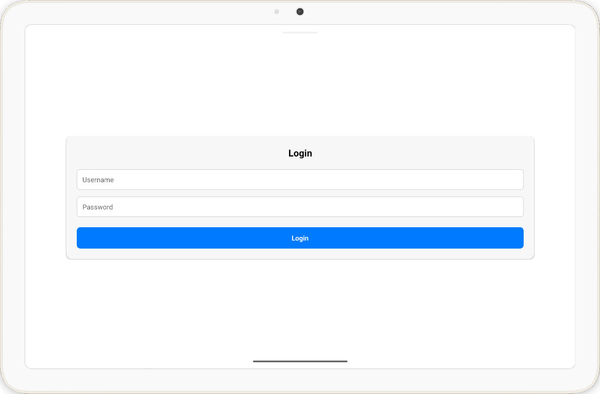
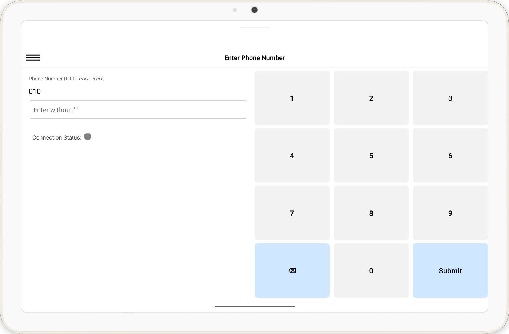
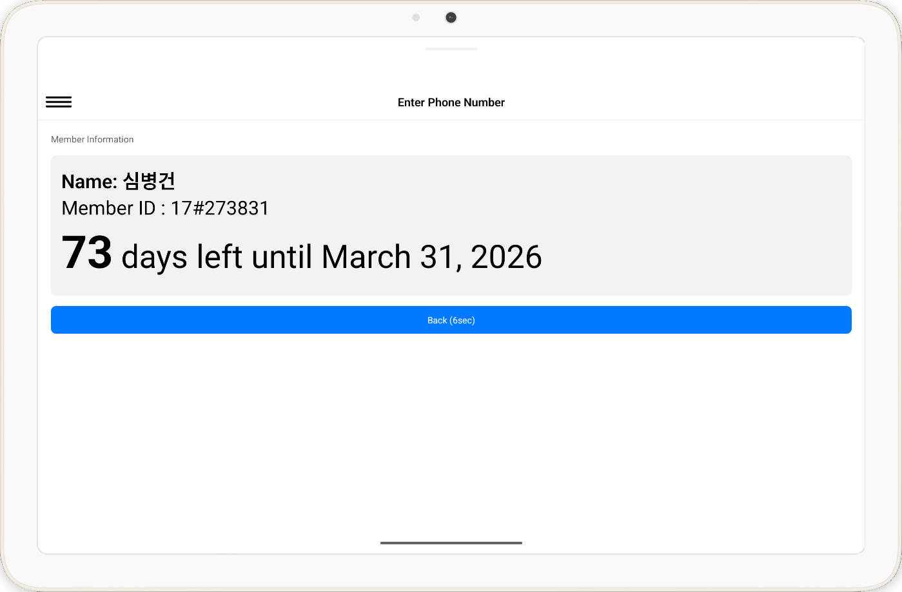

# 📟 Gym Check-in Kiosk App (React Native)

This project is a **React Native kiosk-style application** used at gym entrances.
Members check in by **entering or tapping their phone number on a tablet**, allowing quick and simple attendance tracking without manual staff intervention.

The app is designed to run on a **shared tablet device** placed at the gym entrance and communicates with a backend API to validate members and record check-in events in real time.

---

## ✨ Features

* Tablet-based kiosk UI optimized for touch input
* Phone number check-in (no login required)
* Real-time attendance registration
* Member validation via backend API
* Large buttons and simplified UI for public use
* Automatic reset after check-in

---

## 🧱 Tech Stack

* **React Native**
* JavaScript / TypeScript
* REST API integration (Gym Management API)
* Fetch API
* Android Tablet (primary target)

---

## 📱 ScreenShot





---


## 🚀 Getting Started

아래는 개발 및 테스트 환경 기준 실행 방법입니다.

### 1. Clone the repository

```bash
git clone https://github.com/humake-dev/touch_app.git
cd gym-checkin-kiosk
```

---

### 2. Install dependencies

```bash
npm install
```

또는

```bash
yarn install
```

---

### 3. Configure environment variables

```bash
cp .env.example .env
```

Backend API endpoint 및 키오스크 식별 정보를 설정하세요.

---

### 4. Run the app

```bash
npx react-native run-android
```

> 이 앱은 태블릿 환경을 기준으로 설계되었습니다.

---

## 🔗 Backend Integration

⚠️ This React Native app **requires** the Gym Management API (FastAPI) to be running.<br>
The app cannot function without the backend API.

This app communicates with the Gym Management API (FastAPI) for all business logic:

- Authentication and authorization
- Membership info

The backend API repository:
- https://github.com/humake-dev/api

⚠️ 이 앱은 Gym Management API (FastAPI)가 실행 중이어야 정상적으로 동작합니다.

---

## 🛠️ Design Considerations

* Designed for **public, shared devices**
* No persistent user session
* Automatic screen reset for privacy
* Minimal UI to reduce user error

---

## 📄 License

MIT License
